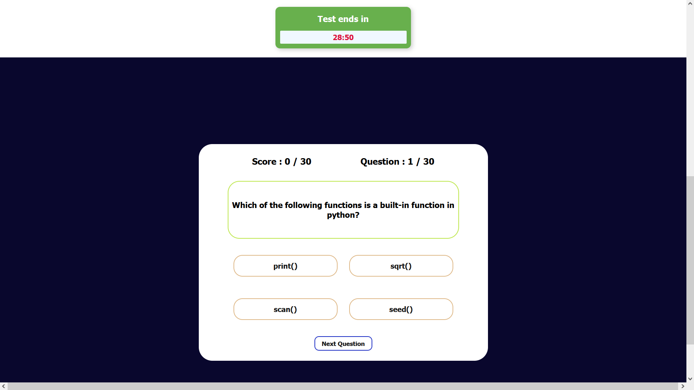
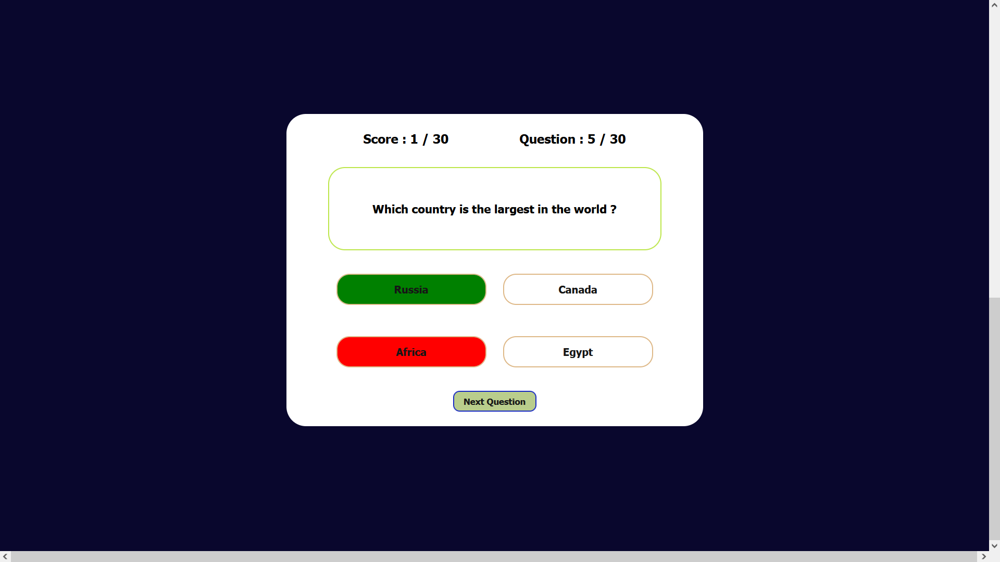
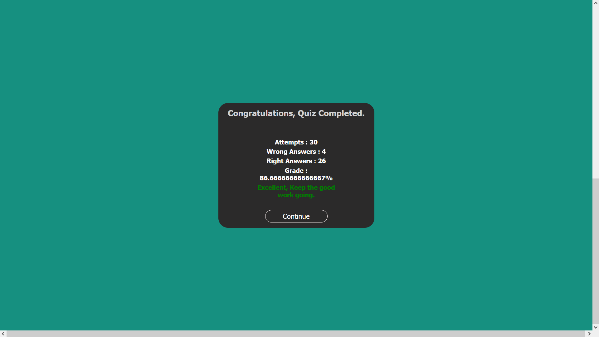

# QUIZZY

<h2>Objective: </h2>

 To build a HTML website that enables you to attend Quizez

<h2>The contents of this Project :</h2>
<ul>
  <li>Color.jpg</li>
  <li>congrats-1.gif</li>
  <li>first page.jpg</li>
  <li>index.css</li>
  <li>index.js</li>
  <li>index.html</li>
  <li>op1.png</li>
  <li>op2.png</li>
  <li>op3.png</li>
 </ul>
 <h2>Output</h2>
 
  
   
